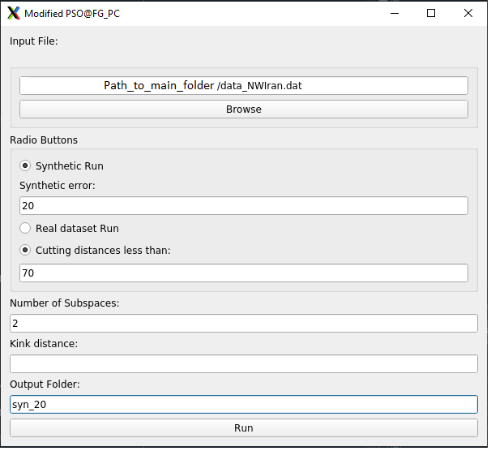
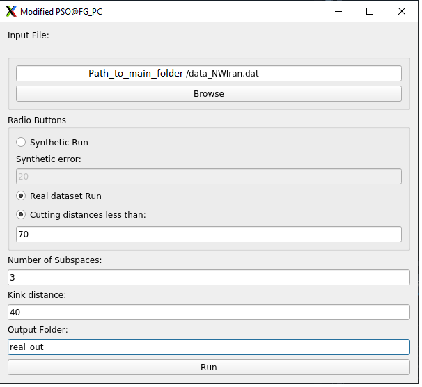

Here is a possible way to modify the readme file to include two sections for the example part:

# Modified PSO Algorithm for Estimating Attenuation Coefficients

This code is designed to use a modified particle swarm optimization (PSO) algorithm to estimate the attenuation coefficients of seismic waves. PSO is a meta-heuristic optimization algorithm that is inspired by swarm behavior observed in nature such as fish and bird schooling². It can find the optimal solution by iteratively moving a population of candidate solutions (called particles) in the search space according to their own and the swarm's best known positions¹.


# Installation

To run this code, you will need the following software and tools:

- Python 3.8
- matplotlib
- numpy
- pyqt5

You can install MATLAB from [here](https://www.mathworks.com/products/matlab.html), and Python 3.8 from [here](https://www.python.org/downloads/). To install matplotlib, numpy and pyqt5, you can use the pip command:

```bash
pip install matplotlib numpy pyqt5
```

To run the code, you need to launch the GUI by running `Uiqt.py` in Python. For more details, see the "Example" section below.
To run the code, you need to launch the GUI by running Uiqt.py in Python. For more details, see the “Example” section below.

# Example

The code includes a graphical user interface (GUI) for running the modified PSO algorithm on synthetic or real data sets. The GUI can be launched by running `Uiqt.py` in Python.

## Synthetic Data Set
The synthetic data set is generated by using the attenuation model of Atkinson and Boore (2003)³ with some random noise added. The data file must contain the following columns: Distance in km, Magnitude, log10(Amplitudes). 
The data file for the synthetic example generated in the main_modified_PSO.m according to the distance and magnitudes in the dataset (`data_NWIran.dat`). 
To run the modified PSO algorithm on the synthetic data set, follow these steps:

- Launch the GUI by running `Uiqt.py` in Python.
- Fill in the fields in the GUI according to the following image:



- Click on the "Run" button to start the optimization process.
- Wait for the process to finish. The output figures will be saved in the folder you defined in the output folder field.

## Real Data Set

The real data set is obtained from a study of seismic attenuation in NW Iran. The data file must contain the following columns: Distance in km, Magnitude, log10(Amplitudes). The data file for the real example is `data_NWIran.dat`.

To run the modified PSO algorithm on the real data set, follow these steps:

- Launch the GUI by running `Uiqt.py` in Python.
- Fill in the fields in the GUI according to the following image:



- Click on the "Run" button to start the optimization process.
- Wait for the process to finish. The output figures will be saved in the folder you defined in the output folder field.


# References

¹ Kennedy J, Eberhart R. Particle swarm optimization. In: Proceedings of IEEE international conference on neural networks. 1995. p. 1942–8.

² Poli R, Kennedy J, Blackwell T. Particle swarm optimization. Swarm Intell 2007;1:33–57.

³ Atkinson GM, Boore DM. Empirical ground-motion relations for subduction-zone earthquakes and their application to Cascadia and other regions. Bull Seismol Soc Am 2003;93:1703–29.
